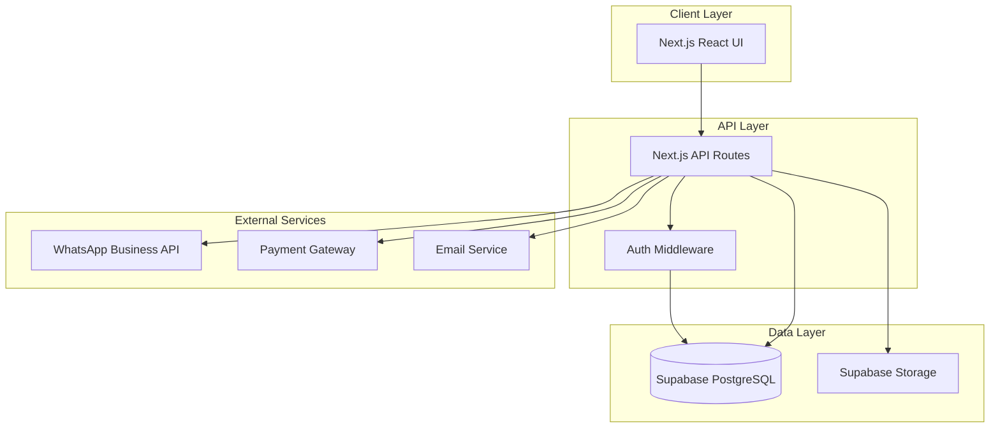

# Design Document: Yatra Booking System

## Overview

The Yatra Booking System is built as an extension to an existing Next.js application with Supabase authentication. The architecture follows a three-tier pattern with Next.js API routes serving as the backend, Supabase PostgreSQL as the database, and React components for the frontend. The system implements role-based access control (RBAC) with two roles: devotees and admins. Key features include draft/publish workflow for yatra packages, flexible accommodation selection with dynamic pricing, WhatsApp OTP verification, and dual-channel notifications (email and WhatsApp).

## Architecture

### System Architecture



### Technology Stack

- **Frontend**: Next.js 14+ with React, TypeScript, Tailwind CSS
- **Backend**: Next.js API Routes
- **Database**: Supabase PostgreSQL
- **Authentication**: Supabase Auth (existing)
- **File Storage**: Supabase Storage
- **Payment**: Razorpay or Stripe
- **Notifications**: 
  - Email: Resend or SendGrid
  - WhatsApp: WhatsApp Business API (Twilio/MessageBird)

### Authentication Flow

The system extends existing Supabase authentication with role-based access and WhatsApp OTP verification:

1. User registers/logs in via Supabase Auth
2. System assigns "devotee" role by default
3. For phone verification: System sends OTP via WhatsApp
4. User enters OTP, system verifies and marks phone as verified
5. Middleware checks role and phone verification status for protected routes

## Components and Interfaces

### Core Components

#### 1. Authentication & Authorization Module

**Purpose**: Manage user authentication, role assignment, and phone verification

**Key Functions**:
- `registerUser(email, password, name, phone)`: Register new user with devotee role
- `sendWhatsAppOTP(phone)`: Generate and send OTP via WhatsApp
- `verifyOTP(phone, otp)`: Verify OTP and mark phone as verified
- `checkRole(userId)`: Get user role for authorization
- `requireAuth(role)`: Middleware to protect routes by role

**Interfaces**:
```typescript
interface User {
  id: string;
  email: string;
  name: string;
  phone: string;
  phone_verified: boolean;
  role: 'devotee' | 'admin';
  address?: string;
  profile_photo_url?: string;
  created_at: Date;
  updated_at: Date;
}

interface OTPVerification {
  phone: string;
  otp: string;
  expires_at: Date;
  attempts: number;
}
```

#### 2. Yatra Package Management Module

**Purpose**: Handle CRUD operations for yatra packages with draft/publish workflow

**Key Functions**:
- `createPackage(packageData, status)`: Create package as draft or active
- `updatePackage(packageId, updates)`: Update package details
- `publishPackage(packageId)`: Change status from draft to active
- `deletePackage(packageId)`: Soft delete if no confirmed bookings
- `getActivePackages()`: Retrieve all active packages for devotees
- `getAllPackages()`: Retrieve all packages including drafts for admins

**Interfaces**:
```typescript
interface YatraPackage {
  id: string;
  name: string;
  description: string;
  destinations: string[];
  duration_days: number;
  duration_nights: number;
  start_date: Date;
  end_date: Date;
  capacity: number;
  available_seats: number;
  base_price: number;
  inclusions: string[];
  itinerary: ItineraryDay[];
  images: string[];
  status: 'draft' | 'active' | 'inactive' | 'completed';
  cancellation_policy: CancellationPolicy;
  created_by: string;
  created_at: Date;
  updated_at: Date;
}

interface ItineraryDay {
  day: number;
  title: string;
  description: string;
  activities: string[];
}

interface CancellationPolicy {
  tiers: CancellationTier[];
}

interface CancellationTier {
  days_before: number;
  refund_percentage: number;
}
```

#### 3. Accommodation Management Module

**Purpose**: Configure and manage accommodation options for yatra packages

**Key Functions**:
- `addAccommodationOption(packageId, option)`: Add accommodation type to package
- `updateAccommodationOption(optionId, updates)`: Update pricing or availability
- `getAccommodationOptions(packageId)`: Get all options for a package
- `validateAccommodationSelection(selections, participantCount)`: Ensure selections match participant count

**Interfaces**:
```typescript
interface AccommodationOption {
  id: string;
  package_id: string;
  room_type: 'dormitory' | '2-person' | '3-person' | '4-person';
  price_per_person_per_night: number;
  available_rooms: number;
  nights: number;
  created_at: Date;
  updated_at: Date;
}

interface AccommodationSelection {
  option_id: string;
  room_type: string;
  participant_ids: string[];
  total_cost: number;
}
```

#### 4. Booking Management Module

**Purpose**: Handle booking creation, modification, and cancellation with accommodation

**Key Functions**:
- `createBooking(userId, packageId, participants, accommodations)`: Create pending booking
- `calculateTotalAmount(packageId, participantCount, accommodations)`: Calculate total with accommodation
- `confirmBooking(bookingId, paymentId)`: Confirm after successful payment
- `cancelBooking(bookingId)`: Cancel and process refund
- `getBookingHistory(userId)`: Get user's booking history
- `updateBookingStatus(bookingId, status)`: Admin function to update status

**Interfaces**:
```typescript
interface Booking {
  id: string;
  user_id: string;
  package_id: string;
  booking_date: Date;
  status: 'pending' | 'confirmed' | 'cancelled' | 'completed';
  total_amount: number;
  base_amount: number;
  accommodation_amount: number;
  payment_status: 'pending' | 'paid' | 'refunded' | 'partially_refunded';
  payment_id?: string;
  refund_amount?: number;
  created_at: Date;
  updated_at: Date;
}

interface Participant {
  id: string;
  booking_id: string;
  name: string;
  age: number;
  gender: 'male' | 'female' | 'other';
  contact: string;
  emergency_contact: string;
  accommodation_selection_id?: string;
}

interface BookingAccommodation {
  id: string;
  booking_id: string;
  accommodation_option_id: string;
  room_type: string;
  participant_count: number;
  nights: number;
  price_per_person_per_night: number;
  total_cost: number;
}
```

#### 5. Payment Processing Module

**Purpose**: Integrate with payment gateway and handle transactions

**Key Functions**:
- `initiatePayment(bookingId, amount)`: Create payment order
- `verifyPayment(paymentId, signature)`: Verify payment callback
- `processRefund(bookingId, amount)`: Initiate refund for cancellation
- `generateReceipt(bookingId)`: Generate PDF receipt

**Interfaces**:
```typescript
interface Payment {
  id: string;
  booking_id: string;
  amount: number;
  currency: string;
  gateway: 'razorpay' | 'stripe';
  gateway_order_id: string;
  gateway_payment_id?: string;
  status: 'created' | 'pending' | 'success' | 'failed';
  created_at: Date;
  updated_at: Date;
}

interface Refund {
  id: string;
  payment_id: string;
  booking_id: string;
  amount: number;
  reason: string;
  gateway_refund_id?: string;
  status: 'pending' | 'processed' | 'failed';
  created_at: Date;
}
```

#### 6. Notification Module

**Purpose**: Send email and WhatsApp notifications

**Key Functions**:
- `sendBookingConfirmation(bookingId)`: Send confirmation via email and WhatsApp
- `sendPaymentReceipt(paymentId)`: Send receipt via email and WhatsApp
- `sendReminder(bookingId)`: Send 7-day reminder
- `sendCancellationNotice(bookingId)`: Send cancellation confirmation
- `notifyAdmin(event, data)`: Send admin notifications

**Interfaces**:
```typescript
interface Notification {
  id: string;
  user_id: string;
  type: 'booking_confirmation' | 'payment_receipt' | 'reminder' | 'cancellation' | 'status_update';
  channel: 'email' | 'whatsapp';
  recipient: string;
  subject?: string;
  message: string;
  status: 'pending' | 'sent' | 'failed';
  sent_at?: Date;
  created_at: Date;
}
```

#### 7. Analytics Module

**Purpose**: Generate reports and analytics for admin dashboard

**Key Functions**:
- `getTotalBookings(startDate, endDate)`: Count bookings in period
- `getTotalRevenue(startDate, endDate)`: Calculate revenue including accommodations
- `getPopularDestinations(startDate, endDate)`: Rank destinations by bookings
- `getBookingTrends(startDate, endDate)`: Generate time-series data
- `getOccupancyRate(packageId)`: Calculate package occupancy
- `getAccommodationPopularity()`: Rank accommodation types

**Interfaces**:
```typescript
interface AnalyticsSummary {
  total_bookings: number;
  total_revenue: number;
  popular_destinations: DestinationStat[];
  booking_trends: TrendData[];
  average_booking_value: number;
}

interface DestinationStat {
  destination: string;
  booking_count: number;
  revenue: number;
}

interface TrendData {
  date: Date;
  booking_count: number;
  revenue: number;
}

interface PackagePerformance {
  package_id: string;
  package_name: string;
  total_capacity: number;
  booked_seats: number;
  occupancy_rate: number;
  revenue: number;
}
```

### API Endpoints

#### Authentication
- `POST /api/auth/register` - Register new user
- `POST /api/auth/send-otp` - Send WhatsApp OTP
- `POST /api/auth/verify-otp` - Verify OTP
- `GET /api/auth/profile` - Get user profile
- `PUT /api/auth/profile` - Update user profile

#### Yatra Packages (Devotee)
- `GET /api/packages` - List active packages with filters
- `GET /api/packages/:id` - Get package details with accommodations

#### Yatra Packages (Admin)
- `POST /api/admin/packages` - Create package (draft or active)
- `PUT /api/admin/packages/:id` - Update package
- `POST /api/admin/packages/:id/publish` - Publish draft package
- `DELETE /api/admin/packages/:id` - Delete package
- `GET /api/admin/packages` - List all packages including drafts

#### Accommodations (Admin)
- `POST /api/admin/packages/:id/accommodations` - Add accommodation option
- `PUT /api/admin/accommodations/:id` - Update accommodation option
- `DELETE /api/admin/accommodations/:id` - Remove accommodation option

#### Bookings (Devotee)
- `POST /api/bookings` - Create booking with accommodations
- `GET /api/bookings` - Get user's booking history
- `GET /api/bookings/:id` - Get booking details
- `POST /api/bookings/:id/cancel` - Cancel booking
- `GET /api/bookings/:id/receipt` - Download receipt PDF

#### Bookings (Admin)
- `GET /api/admin/bookings` - List all bookings with filters
- `PUT /api/admin/bookings/:id/status` - Update booking status
- `GET /api/admin/bookings/export` - Export bookings as CSV

#### Payments
- `POST /api/payments/initiate` - Create payment order
- `POST /api/payments/verify` - Verify payment callback
- `POST /api/payments/webhook` - Handle payment gateway webhook

#### Analytics (Admin)
- `GET /api/admin/analytics/summary` - Get analytics summary
- `GET /api/admin/analytics/trends` - Get booking trends
- `GET /api/admin/analytics/packages` - Get package performance

## Data Models

### Database Schema

```sql
-- Users table (extends Supabase auth.users)
CREATE TABLE public.profiles (
  id UUID PRIMARY KEY REFERENCES auth.users(id),
  name TEXT NOT NULL,
  phone TEXT NOT NULL,
  phone_verified BOOLEAN DEFAULT FALSE,
  role TEXT NOT NULL DEFAULT 'devotee' CHECK (role IN ('devotee', 'admin')),
  address TEXT,
  profile_photo_url TEXT,
  created_at TIMESTAMPTZ DEFAULT NOW(),
  updated_at TIMESTAMPTZ DEFAULT NOW()
);

-- OTP verifications
CREATE TABLE public.otp_verifications (
  id UUID PRIMARY KEY DEFAULT gen_random_uuid(),
  phone TEXT NOT NULL,
  otp TEXT NOT NULL,
  expires_at TIMESTAMPTZ NOT NULL,
  attempts INTEGER DEFAULT 0,
  verified BOOLEAN DEFAULT FALSE,
  created_at TIMESTAMPTZ DEFAULT NOW()
);

-- Yatra packages
CREATE TABLE public.yatra_packages (
  id UUID PRIMARY KEY DEFAULT gen_random_uuid(),
  name TEXT NOT NULL,
  description TEXT NOT NULL,
  destinations TEXT[] NOT NULL,
  duration_days INTEGER NOT NULL,
  duration_nights INTEGER NOT NULL,
  start_date DATE NOT NULL,
  end_date DATE NOT NULL,
  capacity INTEGER NOT NULL,
  available_seats INTEGER NOT NULL,
  base_price DECIMAL(10,2) NOT NULL,
  inclusions TEXT[] NOT NULL,
  itinerary JSONB NOT NULL,
  images TEXT[] DEFAULT '{}',
  status TEXT NOT NULL DEFAULT 'draft' CHECK (status IN ('draft', 'active', 'inactive', 'completed')),
  cancellation_policy JSONB NOT NULL,
  created_by UUID REFERENCES public.profiles(id),
  created_at TIMESTAMPTZ DEFAULT NOW(),
  updated_at TIMESTAMPTZ DEFAULT NOW(),
  deleted_at TIMESTAMPTZ
);

-- Accommodation options
CREATE TABLE public.accommodation_options (
  id UUID PRIMARY KEY DEFAULT gen_random_uuid(),
  package_id UUID NOT NULL REFERENCES public.yatra_packages(id) ON DELETE CASCADE,
  room_type TEXT NOT NULL CHECK (room_type IN ('dormitory', '2-person', '3-person', '4-person')),
  price_per_person_per_night DECIMAL(10,2) NOT NULL,
  available_rooms INTEGER NOT NULL,
  nights INTEGER NOT NULL,
  created_at TIMESTAMPTZ DEFAULT NOW(),
  updated_at TIMESTAMPTZ DEFAULT NOW()
);

-- Bookings
CREATE TABLE public.bookings (
  id UUID PRIMARY KEY DEFAULT gen_random_uuid(),
  user_id UUID NOT NULL REFERENCES public.profiles(id),
  package_id UUID NOT NULL REFERENCES public.yatra_packages(id),
  booking_date TIMESTAMPTZ DEFAULT NOW(),
  status TEXT NOT NULL DEFAULT 'pending' CHECK (status IN ('pending', 'confirmed', 'cancelled', 'completed')),
  total_amount DECIMAL(10,2) NOT NULL,
  base_amount DECIMAL(10,2) NOT NULL,
  accommodation_amount DECIMAL(10,2) NOT NULL,
  payment_status TEXT NOT NULL DEFAULT 'pending' CHECK (payment_status IN ('pending', 'paid', 'refunded', 'partially_refunded')),
  payment_id TEXT,
  refund_amount DECIMAL(10,2),
  created_at TIMESTAMPTZ DEFAULT NOW(),
  updated_at TIMESTAMPTZ DEFAULT NOW()
);

-- Participants
CREATE TABLE public.participants (
  id UUID PRIMARY KEY DEFAULT gen_random_uuid(),
  booking_id UUID NOT NULL REFERENCES public.bookings(id) ON DELETE CASCADE,
  name TEXT NOT NULL,
  age INTEGER NOT NULL CHECK (age >= 1 AND age <= 120),
  gender TEXT NOT NULL CHECK (gender IN ('male', 'female', 'other')),
  contact TEXT NOT NULL,
  emergency_contact TEXT NOT NULL,
  created_at TIMESTAMPTZ DEFAULT NOW()
);

-- Booking accommodations
CREATE TABLE public.booking_accommodations (
  id UUID PRIMARY KEY DEFAULT gen_random_uuid(),
  booking_id UUID NOT NULL REFERENCES public.bookings(id) ON DELETE CASCADE,
  accommodation_option_id UUID NOT NULL REFERENCES public.accommodation_options(id),
  room_type TEXT NOT NULL,
  participant_count INTEGER NOT NULL,
  nights INTEGER NOT NULL,
  price_per_person_per_night DECIMAL(10,2) NOT NULL,
  total_cost DECIMAL(10,2) NOT NULL,
  participant_ids UUID[] NOT NULL,
  created_at TIMESTAMPTZ DEFAULT NOW()
);

-- Payments
CREATE TABLE public.payments (
  id UUID PRIMARY KEY DEFAULT gen_random_uuid(),
  booking_id UUID NOT NULL REFERENCES public.bookings(id),
  amount DECIMAL(10,2) NOT NULL,
  currency TEXT NOT NULL DEFAULT 'INR',
  gateway TEXT NOT NULL CHECK (gateway IN ('razorpay', 'stripe')),
  gateway_order_id TEXT NOT NULL,
  gateway_payment_id TEXT,
  status TEXT NOT NULL DEFAULT 'created' CHECK (status IN ('created', 'pending', 'success', 'failed')),
  created_at TIMESTAMPTZ DEFAULT NOW(),
  updated_at TIMESTAMPTZ DEFAULT NOW()
);

-- Refunds
CREATE TABLE public.refunds (
  id UUID PRIMARY KEY DEFAULT gen_random_uuid(),
  payment_id UUID NOT NULL REFERENCES public.payments(id),
  booking_id UUID NOT NULL REFERENCES public.bookings(id),
  amount DECIMAL(10,2) NOT NULL,
  reason TEXT NOT NULL,
  gateway_refund_id TEXT,
  status TEXT NOT NULL DEFAULT 'pending' CHECK (status IN ('pending', 'processed', 'failed')),
  created_at TIMESTAMPTZ DEFAULT NOW()
);

-- Notifications
CREATE TABLE public.notifications (
  id UUID PRIMARY KEY DEFAULT gen_random_uuid(),
  user_id UUID REFERENCES public.profiles(id),
  type TEXT NOT NULL CHECK (type IN ('booking_confirmation', 'payment_receipt', 'reminder', 'cancellation', 'status_update')),
  channel TEXT NOT NULL CHECK (channel IN ('email', 'whatsapp')),
  recipient TEXT NOT NULL,
  subject TEXT,
  message TEXT NOT NULL,
  status TEXT NOT NULL DEFAULT 'pending' CHECK (status IN ('pending', 'sent', 'failed')),
  sent_at TIMESTAMPTZ,
  created_at TIMESTAMPTZ DEFAULT NOW()
);

-- Indexes for performance
CREATE INDEX idx_profiles_phone ON public.profiles(phone);
CREATE INDEX idx_profiles_role ON public.profiles(role);
CREATE INDEX idx_packages_status ON public.yatra_packages(status);
CREATE INDEX idx_packages_start_date ON public.yatra_packages(start_date);
CREATE INDEX idx_bookings_user_id ON public.bookings(user_id);
CREATE INDEX idx_bookings_package_id ON public.bookings(package_id);
CREATE INDEX idx_bookings_status ON public.bookings(status);
CREATE INDEX idx_participants_booking_id ON public.participants(booking_id);
CREATE INDEX idx_booking_accommodations_booking_id ON public.booking_accommodations(booking_id);
CREATE INDEX idx_payments_booking_id ON public.payments(booking_id);
CREATE INDEX idx_notifications_user_id ON public.notifications(user_id);
```

### Row Level Security (RLS) Policies

```sql
-- Enable RLS on all tables
ALTER TABLE public.profiles ENABLE ROW LEVEL SECURITY;
ALTER TABLE public.yatra_packages ENABLE ROW LEVEL SECURITY;
ALTER TABLE public.accommodation_options ENABLE ROW LEVEL SECURITY;
ALTER TABLE public.bookings ENABLE ROW LEVEL SECURITY;
ALTER TABLE public.participants ENABLE ROW LEVEL SECURITY;
ALTER TABLE public.booking_accommodations ENABLE ROW LEVEL SECURITY;

-- Profiles: Users can read/update their own profile, admins can read all
CREATE POLICY "Users can view own profile" ON public.profiles
  FOR SELECT USING (auth.uid() = id OR (SELECT role FROM public.profiles WHERE id = auth.uid()) = 'admin');

CREATE POLICY "Users can update own profile" ON public.profiles
  FOR UPDATE USING (auth.uid() = id);

-- Yatra packages: Everyone can read active packages, admins can manage all
CREATE POLICY "Anyone can view active packages" ON public.yatra_packages
  FOR SELECT USING (status = 'active' OR (SELECT role FROM public.profiles WHERE id = auth.uid()) = 'admin');

CREATE POLICY "Admins can insert packages" ON public.yatra_packages
  FOR INSERT WITH CHECK ((SELECT role FROM public.profiles WHERE id = auth.uid()) = 'admin');

CREATE POLICY "Admins can update packages" ON public.yatra_packages
  FOR UPDATE USING ((SELECT role FROM public.profiles WHERE id = auth.uid()) = 'admin');

-- Bookings: Users can view their own bookings, admins can view all
CREATE POLICY "Users can view own bookings" ON public.bookings
  FOR SELECT USING (user_id = auth.uid() OR (SELECT role FROM public.profiles WHERE id = auth.uid()) = 'admin');

CREATE POLICY "Users can create bookings" ON public.bookings
  FOR INSERT WITH CHECK (user_id = auth.uid());

CREATE POLICY "Users can update own bookings" ON public.bookings
  FOR UPDATE USING (user_id = auth.uid() OR (SELECT role FROM public.profiles WHERE id = auth.uid()) = 'admin');
```

## Correctness Properties


*A property is a characteristic or behavior that should hold true across all valid executions of a system—essentially, a formal statement about what the system should do. Properties serve as the bridge between human-readable specifications and machine-verifiable correctness guarantees.*

### Authentication and Authorization Properties

**Property 1: Default role assignment**
*For any* new user registration, the system should assign the "devotee" role by default.
**Validates: Requirements 1.2**

**Property 2: Phone verification requirement**
*For any* user without phone verification, booking creation attempts should be rejected with an authorization error.
**Validates: Requirements 1.8**

**Property 3: OTP verification state transition**
*For any* valid OTP entry, the system should mark the associated phone number as verified.
**Validates: Requirements 1.7**

**Property 4: Role-based access control**
*For any* user with role R and protected resource requiring role R', access should be granted if and only if R has permissions of R'.
**Validates: Requirements 1.3, 2.2, 2.3**

**Property 5: Admin data access scope**
*For any* admin user, queries for bookings should return all bookings across all users, while devotee queries should return only their own bookings.
**Validates: Requirements 2.4, 8.1**

### Data Persistence Properties

**Property 6: Profile update round-trip**
*For any* valid profile update, reading the profile immediately after should return the updated values.
**Validates: Requirements 1.4, 1.5, 15.1**

**Property 7: Package data round-trip**
*For any* yatra package creation with valid data, retrieving the package should return all stored fields (name, description, destinations, duration, dates, capacity, base price, inclusions, itinerary, images, status).
**Validates: Requirements 3.1**

**Property 8: Accommodation data round-trip**
*For any* accommodation option creation, retrieving the option should return all stored fields (room type, price per person per night, availability, nights).
**Validates: Requirements 4.3, 4.4**

### Package Management Properties

**Property 9: Draft package visibility**
*For any* yatra package with status "draft", devotee queries should never return that package, while admin queries should include it.
**Validates: Requirements 3.3**

**Property 10: Draft to active transition**
*For any* draft package, publishing should change its status to "active" and make it visible in devotee queries.
**Validates: Requirements 3.4**

**Property 11: Package deletion with bookings**
*For any* yatra package with at least one confirmed booking, deletion attempts should be rejected with an error.
**Validates: Requirements 3.6**

**Property 12: Package update preserves bookings**
*For any* yatra package update, all existing booking records referencing that package should remain unchanged.
**Validates: Requirements 3.5, 4.7**

### Input Validation Properties

**Property 13: Date range validation**
*For any* yatra package creation or update, if start_date >= end_date, the operation should be rejected with a validation error.
**Validates: Requirements 3.7**

**Property 14: Positive numeric validation**
*For any* yatra package or accommodation option, if capacity, base_price, or accommodation_price is not a positive number, the operation should be rejected with a validation error.
**Validates: Requirements 3.8, 3.9, 4.5**

**Property 15: Accommodation nights validation**
*For any* accommodation option, if nights is not a positive integer or exceeds the yatra duration, the operation should be rejected with a validation error.
**Validates: Requirements 4.6**

**Property 16: Email format validation**
*For any* email input, if it doesn't match a valid email format, the operation should be rejected with a validation error.
**Validates: Requirements 12.3**

**Property 17: Phone format validation**
*For any* phone number input, if it doesn't match Indian mobile number format (10 digits), the operation should be rejected with a validation error.
**Validates: Requirements 12.4**

**Property 18: Age range validation**
*For any* participant age input, if age < 1 or age > 120, the operation should be rejected with a validation error.
**Validates: Requirements 12.5**

**Property 19: Participant details completeness**
*For any* booking creation, if any participant is missing required fields (name, age, gender, contact, emergency_contact), the operation should be rejected with a validation error.
**Validates: Requirements 6.2**

### Filtering and Search Properties

**Property 20: Query filtering correctness**
*For any* query with filter criteria (destination, date range, price range, status, package_id), all returned results should match the specified criteria.
**Validates: Requirements 5.2, 5.3, 5.4, 7.2, 7.3, 7.4, 8.2, 8.3, 8.4**

**Property 21: Keyword search matching**
*For any* keyword search query, all returned packages should contain the keyword in at least one of: name, description, or destinations.
**Validates: Requirements 5.5**

**Property 22: Active package filtering**
*For any* devotee query for yatra packages without explicit status filter, only packages with status "active" should be returned.
**Validates: Requirements 5.1**

### Accommodation Selection Properties

**Property 23: Accommodation capacity matching**
*For any* booking with accommodation selections, the sum of participants across all room selections should equal the total number of participants in the booking.
**Validates: Requirements 12.6**

**Property 24: Room type capacity validation**
*For any* accommodation selection, if a room type is "N-person" and the number of assigned participants is not exactly N, the operation should be rejected with a validation error.
**Validates: Requirements 12.7, 6.4, 6.5**

**Property 25: Mixed accommodation support**
*For any* booking with multiple participants, the system should accept accommodation selections that combine different room types as long as total capacity matches participant count.
**Validates: Requirements 6.3, 6.6**

### Pricing Calculation Properties

**Property 26: Total amount calculation**
*For any* booking, total_amount should equal (base_price × participant_count) + accommodation_amount.
**Validates: Requirements 6.7**

**Property 27: Accommodation cost calculation**
*For any* accommodation selection, the cost should equal (price_per_person_per_night × nights × participant_count_in_room).
**Validates: Requirements 6.8**

**Property 28: Cancellation refund calculation**
*For any* booking cancellation, the refund amount should be calculated by finding the applicable cancellation tier based on days before start date and applying that tier's refund percentage to the total amount.
**Validates: Requirements 9.6, 13.3**

### Seat Availability Properties

**Property 29: Initial seat availability**
*For any* newly created yatra package, available_seats should equal capacity.
**Validates: Requirements 14.1**

**Property 30: Seat availability invariant**
*For any* yatra package, the invariant (capacity - available_seats) should equal the sum of participants across all confirmed bookings for that package.
**Validates: Requirements 14.2, 14.3, 7.6**

**Property 31: Overbooking prevention**
*For any* booking attempt, if the number of requested participants exceeds available_seats, the operation should be rejected with an error.
**Validates: Requirements 6.1, 14.5**

**Property 32: Concurrent booking safety**
*For any* set of concurrent booking attempts on the same package, the total confirmed participants should never exceed the package capacity.
**Validates: Requirements 12.2**

### Booking State Management Properties

**Property 33: Payment success state transition**
*For any* successful payment, the booking status should transition to "confirmed", payment_status should become "paid", and available_seats should decrease by participant count.
**Validates: Requirements 6.10, 9.4**

**Property 34: Payment failure state preservation**
*For any* failed payment, the booking status should remain "pending" and available_seats should remain unchanged.
**Validates: Requirements 6.11, 9.5**

**Property 35: Cancellation state transition**
*For any* booking cancellation, the booking status should change to "cancelled", available_seats should increase by participant count, and a refund record should be created.
**Validates: Requirements 7.5, 7.6**

**Property 36: Booking modification deadline enforcement**
*For any* booking modification attempt, if current_date > (start_date - modification_deadline_days), the operation should be rejected with an error.
**Validates: Requirements 7.8, 7.9**

### Notification Properties

**Property 37: Event-triggered notifications**
*For any* booking state change event (confirmed, cancelled, status_updated), notification records should be created for both email and WhatsApp channels.
**Validates: Requirements 6.12, 10.1, 10.2, 10.4, 10.5**

**Property 38: Admin notification on booking creation**
*For any* new booking creation, a notification record should be created for admin users via email.
**Validates: Requirements 10.6**

**Property 39: Reminder notification scheduling**
*For any* confirmed booking where (start_date - current_date) = 7 days, reminder notification records should be created for all participants.
**Validates: Requirements 10.3**

### Data Completeness Properties

**Property 40: Package detail completeness**
*For any* package detail response, it should include all fields: itinerary, inclusions, available_seats, accommodation_options, and images.
**Validates: Requirements 5.6**

**Property 41: Booking detail completeness**
*For any* booking detail response, it should include all fields: status, dates, package_information, accommodation_details, participant_information, and payment_status.
**Validates: Requirements 7.1, 8.5**

**Property 42: Receipt completeness**
*For any* generated receipt (PDF or payment receipt), it should include: booking_details, payment_information, participant_list, accommodation_breakdown, transaction_id, base_amount, accommodation_charges, and total_amount.
**Validates: Requirements 7.7, 9.3**

**Property 43: Export data completeness**
*For any* booking data export (CSV), it should include all fields: booking_information, participant_details, accommodation_selections, and payment_status.
**Validates: Requirements 8.7**

### Analytics Properties

**Property 44: Booking count accuracy**
*For any* analytics query with date range, the total_bookings count should equal the number of bookings where booking_date falls within that range.
**Validates: Requirements 11.1**

**Property 45: Revenue calculation accuracy**
*For any* analytics query with date range, the total_revenue should equal the sum of total_amount for all confirmed bookings within that range.
**Validates: Requirements 11.2**

**Property 46: Destination ranking correctness**
*For any* popular destinations list, destinations should be ordered by booking count in descending order.
**Validates: Requirements 11.3**

**Property 47: Occupancy rate calculation**
*For any* yatra package, occupancy_rate should equal (booked_seats / capacity) × 100.
**Validates: Requirements 11.6**

**Property 48: Accommodation popularity ranking**
*For any* accommodation analytics, room types should be ordered by usage count in descending order.
**Validates: Requirements 11.7**

## Error Handling

### Error Categories

1. **Validation Errors** (400 Bad Request)
   - Invalid input formats (email, phone, dates)
   - Missing required fields
   - Out-of-range values (age, capacity, price)
   - Business rule violations (start_date >= end_date)

2. **Authorization Errors** (401 Unauthorized, 403 Forbidden)
   - Unauthenticated requests
   - Insufficient permissions (devotee accessing admin routes)
   - Unverified phone number attempting booking

3. **Resource Errors** (404 Not Found)
   - Package not found
   - Booking not found
   - User not found

4. **Conflict Errors** (409 Conflict)
   - Insufficient seats available
   - Package has confirmed bookings (cannot delete)
   - Concurrent booking conflicts
   - Modification deadline passed

5. **External Service Errors** (502 Bad Gateway, 503 Service Unavailable)
   - Payment gateway failures
   - WhatsApp API failures
   - Email service failures
   - Storage service failures

### Error Response Format

All API errors should return consistent JSON structure:

```typescript
interface ErrorResponse {
  error: {
    code: string;
    message: string;
    details?: Record<string, any>;
    timestamp: string;
  };
}
```

### Error Handling Strategies

1. **Validation Errors**: Return immediately with descriptive messages
2. **Authorization Errors**: Log attempt and return generic message
3. **Resource Errors**: Return 404 with resource type
4. **Conflict Errors**: Return current state information
5. **External Service Errors**: Implement retry logic with exponential backoff, log for monitoring

### Transaction Management

Critical operations requiring atomicity:

1. **Booking Confirmation**:
   - Update booking status
   - Decrement available seats
   - Create payment record
   - Create notification records
   - Rollback all if any step fails

2. **Booking Cancellation**:
   - Update booking status
   - Increment available seats
   - Create refund record
   - Create notification records
   - Rollback all if any step fails

3. **Concurrent Bookings**:
   - Use database row-level locking on yatra_packages
   - Check available seats within transaction
   - Prevent race conditions

## Testing Strategy

### Dual Testing Approach

The system requires both unit testing and property-based testing for comprehensive coverage:

- **Unit tests**: Verify specific examples, edge cases, and error conditions
- **Property tests**: Verify universal properties across all inputs
- Both approaches are complementary and necessary

### Unit Testing

Unit tests should focus on:

1. **Specific Examples**:
   - User registration with valid data
   - Package creation with complete information
   - Booking with 2-person and 3-person room combination
   - Cancellation 15 days before start date

2. **Edge Cases**:
   - Booking with exactly available seats
   - Cancellation on the last allowed day
   - Package with zero available seats
   - Empty search results

3. **Error Conditions**:
   - Invalid email format
   - Negative prices
   - Start date after end date
   - Unauthorized access attempts

4. **Integration Points**:
   - Supabase authentication flow
   - Payment gateway webhook handling
   - WhatsApp API integration
   - File upload to Supabase Storage

### Property-Based Testing

Property tests should be implemented using a PBT library appropriate for the language (e.g., fast-check for TypeScript/JavaScript).

**Configuration**:
- Minimum 100 iterations per property test
- Each test must reference its design document property
- Tag format: `Feature: yatra-booking-system, Property {number}: {property_text}`

**Property Test Coverage**:

Each correctness property (Properties 1-48) should have a corresponding property-based test that:
1. Generates random valid inputs
2. Executes the operation
3. Verifies the property holds

**Example Property Test Structure**:

```typescript
// Feature: yatra-booking-system, Property 26: Total amount calculation
test('total amount equals base price times participants plus accommodation', async () => {
  await fc.assert(
    fc.asyncProperty(
      packageGenerator(),
      participantCountGenerator(1, 10),
      accommodationSelectionsGenerator(),
      async (pkg, participantCount, accommodations) => {
        const booking = await createBooking(pkg.id, participantCount, accommodations);
        const expectedTotal = (pkg.base_price * participantCount) + 
                            calculateAccommodationTotal(accommodations);
        expect(booking.total_amount).toBe(expectedTotal);
      }
    ),
    { numRuns: 100 }
  );
});
```

### Test Data Generators

Property tests require generators for:

- **Users**: Random name, email, phone, role
- **Packages**: Random dates, capacity, prices, destinations
- **Accommodations**: Random room types, prices, nights
- **Bookings**: Random participant counts, accommodation selections
- **Dates**: Random date ranges respecting constraints

### Testing Priorities

1. **Critical Path** (Must have 100% coverage):
   - Booking creation and confirmation
   - Payment processing
   - Seat availability management
   - Cancellation and refunds

2. **High Priority**:
   - Authentication and authorization
   - Package management
   - Accommodation selection
   - Data validation

3. **Medium Priority**:
   - Notifications
   - Analytics
   - Search and filtering
   - Profile management

### Continuous Testing

- Run unit tests on every commit
- Run property tests on every pull request
- Monitor test execution time
- Maintain test coverage above 80%
- Track property test failure rates
